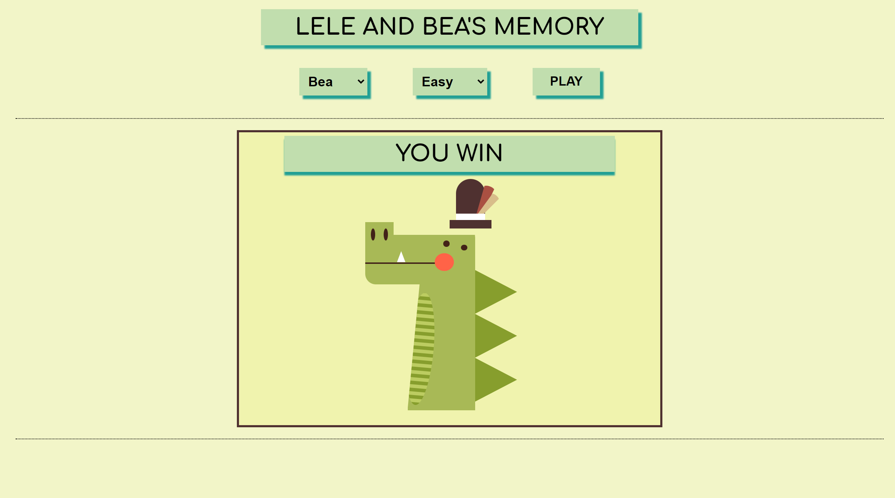

# Lele and Bea's memory

Welcome to Lele and Bea's memory, a memory game created with Vue.js where you can choose three different levels and two types of images for the cards.

This project was created to entertain two wonderful two- and three-year-olds: Lele, a crocodile lover; Bea, who would like to have a dog. For this reason I left a little help for the resolution... can you figure out which one?

[Take a look](https://leleandbeamemory.netlify.app)

## Features

- Displays a funny and "crocodile centric" user interface.
- Change three different levels that will change the number of cards in play;
- Choose from images of crocodiles or images of dogs for your cards;




## Installation

1.  Clone the repository

```bash
 git clone https://github.com/Luega/MemoryGame.git
```

2. Change the working directory

```bash
  cd /MemoryGame
```

3. Install dependencies

```bash
  npm install
```

## Usage

1. Start the development server

```bash
npm run serve
```

2. Open your browser and visit http://localhost:8080 to see the app in action.

## License

This project is licensed under the [MIT](https://choosealicense.com/licenses/mit/) License.
